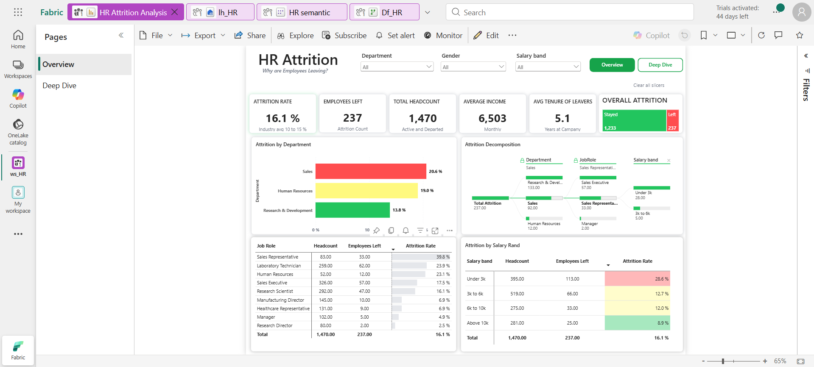
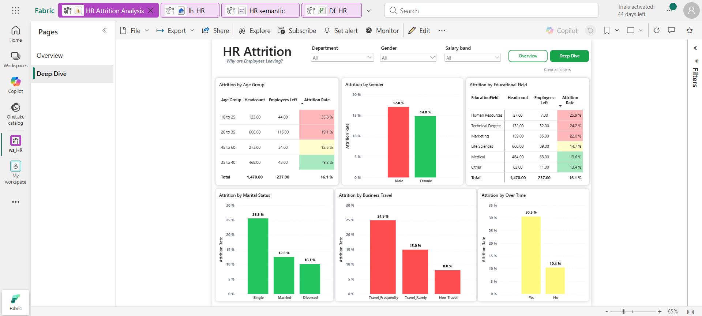
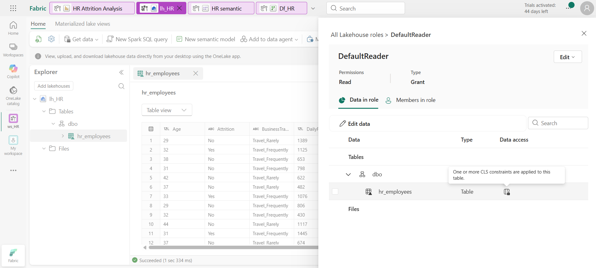

# HR Employee Attrition Analysis | Microsoft Fabric & Power BI

An end-to-end HR analytics solution built using **Microsoft Fabric and Power BI** to help HR Leadership understand employee attrition, identify high-attrition employee segments, and analyze factors associated with employee turnover.

## Dashboard Screenshots

### Overview Dashboard



### Deep Dive Dashboard



### Fabric Security Configuration



## Business Problem

The HR Leadership team wanted to understand:

- What is the overall employee attrition rate?
- Which departments are losing the most employees?
- Is there a relationship between employee pay and attrition?
- Is there a relationship between employee age and attrition?
- Which employee segments show relatively higher attrition?

The final solution was designed as a **fully automated, governed, and secured HR analytics dashboard**.

---

## Key Business KPIs

| KPI | Value |
|---|---:|
| Total Headcount | 1,470 |
| Employees Left | 237 |
| Employees Stayed | 1,233 |
| Overall Attrition Rate | 16.1% |
| Average Monthly Income | 6,503 |
| Average Tenure of Leavers | 5.1 years |

---

## Technology Stack

- **Microsoft Fabric**
- **Fabric Workspace**
- **Dataflow Gen2**
- **Power Query**
- **Microsoft Fabric Lakehouse**
- **Fabric Semantic Model**
- **Power BI**
- **DAX**
- **Column-Level Security (CLS)**

---

## Solution Architecture

```text
HR Data Source
      │
      ▼
Microsoft Fabric Workspace
      │
      ▼
Dataflow Gen2
      │
      ├── URL-based Data Ingestion
      │
      └── Power Query Transformations
              │
              ├── Salary Band
              └── Age Group
              │
              ▼
        Fabric Lakehouse
              │
              ▼
          Flat Table
              │
              ▼
       Semantic Model
              │
              ▼
        Power BI Report
          │         │
          ▼         ▼
      Overview   Deep Dive
              │
              ▼
        Publish to Fabric
              │
              ▼
     Column-Level Security
```

---

## Data Ingestion & Transformation

### Dataflow Gen2

Data was ingested using **Dataflow Gen2** through a URL-based source.

Dataflow Gen2 was selected instead of a more technically complex ingestion approach because the solution was intended for the HR team to maintain in the future.

The HR team is familiar with **Excel and Power Query**, making the Power Query-based Dataflow Gen2 experience easier to understand and maintain.

### Power Query Transformations

Two derived categorical fields were created:

#### Salary Band

| Monthly Income | Salary Band |
|---|---|
| ≤ 3,000 | Under 3k |
| 3,001–6,000 | 3k to 6k |
| 6,001–10,000 | 6k to 10k |
| > 10,000 | Above 10k |

#### Age Group

Employees were grouped into meaningful age segments to support demographic attrition analysis.

---

## Data Storage

The transformed data was loaded from **Dataflow Gen2 into a Microsoft Fabric Lakehouse**.

For this project, a **flat-table approach** was used because the source dataset is employee-level and the analytical requirements could be addressed without introducing unnecessary model complexity.

---

## Semantic Model

A semantic model was created directly from the Fabric Lakehouse.

The semantic model acts as the analytical layer between the Lakehouse and Power BI report.

---

## Power BI Report

The report contains two analytical pages.

### 1. Overview

The Overview page provides HR Leadership with a high-level view of employee attrition.

Key analysis includes:

- Attrition Rate
- Employees Left
- Total Headcount
- Average Monthly Income
- Average Tenure of Leavers
- Overall Stayed vs Left
- Attrition by Department
- Attrition by Job Role
- Attrition by Salary Band
- Attrition Decomposition
- Interactive filters for Department, Gender and Salary Band

### 2. Deep Dive

The Deep Dive page provides more detailed employee-segment analysis.

Analysis includes:

- Attrition by Age Group
- Attrition by Gender
- Attrition by Educational Field
- Attrition by Marital Status
- Attrition by Business Travel
- Attrition over time

---


## Security

Employee compensation information is sensitive, so **Column-Level Security (CLS)** was applied to restrict access to the `MonthlyIncome` column.

This adds a security layer to the HR analytics solution and helps prevent unauthorized exposure of sensitive compensation information.

---

## Key Insights

The dashboard provides visibility into several important attrition patterns:

- Overall attrition is **16.1%**, with **237 employees** leaving out of **1,470**.
- **Sales** shows the highest department-level attrition rate among the departments displayed.
- The **Under 3k salary band** has a substantially higher attrition rate than the higher salary bands.
- Younger employee groups show higher attrition compared with older groups.
- Employees who travel frequently show higher attrition than non-travelling employees.
- Male employees show a higher attrition rate than female employees in the analyzed dataset.
- Single employees show higher attrition than married and divorced employees.

These findings can help HR Leadership identify employee segments that may require deeper investigation and targeted retention strategies.

> Note: These are observed associations in the analyzed dataset and should not automatically be interpreted as causal relationships.

---

## Project Highlights

- End-to-end Microsoft Fabric analytics workflow
- URL-based data ingestion using Dataflow Gen2
- Power Query-based data transformation
- Lakehouse-based data storage
- Semantic modeling
- DAX-based KPI development
- Interactive Power BI dashboard
- Drill-down/decomposition analysis
- Business-focused HR attrition analysis
- Sensitive salary information protected using Column-Level Security
- Designed with maintainability in mind for non-technical HR users

---

## Skills Demonstrated

**Microsoft Fabric:**  
Dataflow Gen2, Lakehouse, Semantic Model, Workspace, Security

**Power BI:**  
Dashboard Development, Data Modeling, DAX, Interactive Reporting, Slicers, Decomposition Analysis

**Data Transformation:**  
Power Query, Conditional Columns, Data Type Management, Data Preparation

**Analytics:**  
Attrition Analysis, Employee Segmentation, KPI Analysis, Demographic Analysis, Salary Analysis

---

## Project Outcome

The project delivers a centralized HR Attrition Analytics solution that enables HR Leadership to move from a general question of **"Why are employees leaving?"** toward identifying specific employee segments and organizational areas associated with higher attrition.

The solution combines **Microsoft Fabric's data platform capabilities with Power BI analytics, DAX and security controls** to provide a maintainable and governed reporting solution.
